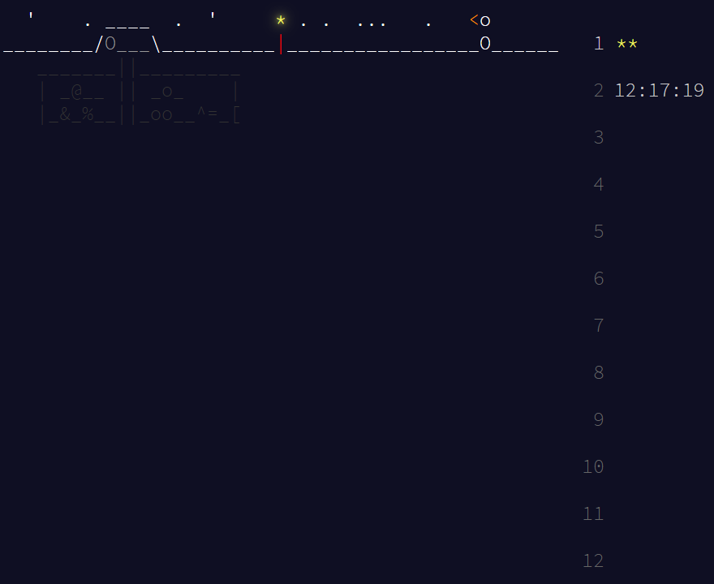

 

<h1 align="center">🎄Advent of Code🎁</h1>

Solutions for the annual <strong>Advent of Code</strong> <a href="https://adventofcode.com/">(Website)</a> challenges

  
  

---

  <em>Made with ❄️ snow, ☕ caffeine, and a suspicious number of console logs.</em>

