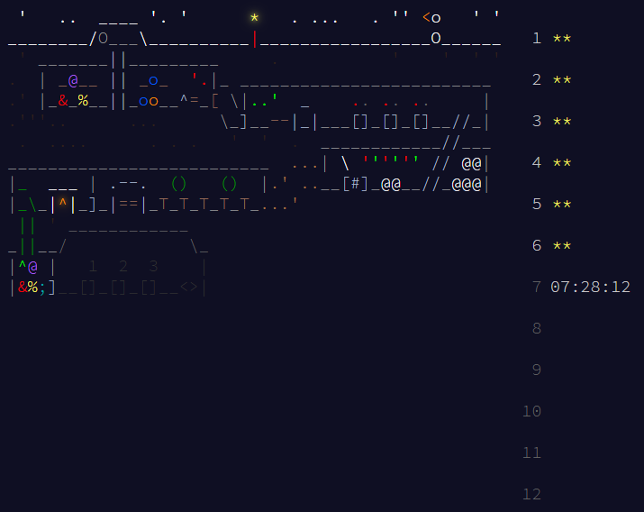

  <em>Console logs to keep the fire burning</em>

<h2 align="center">🎄 Advent of Code 🎁</h2>

  
Solutions for the annual <strong>Advent of Code</strong> <a href="https://adventofcode.com/">(Website)</a> challenges

  

